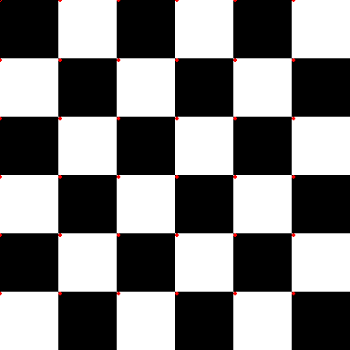

# Computer_vision_task_3

## Harris Feature Detection
### 1- Set the parameters
### 2- Read the Image
* Image is read using openCV in grayscale.

### 3- Calculate Image gradients
* Kernel operation using input operator of size 3*3
* Run the Sobel kernel for each pixel
* Eliminate the negative values: Multiply by -1

### 4- Use Gaussian blur

### 5- Calculate corner strength

### 6- Look for Corner strengths above the threshold

### 7- Perform Non-Maximum Suppression

## Input

## Ouptut 
