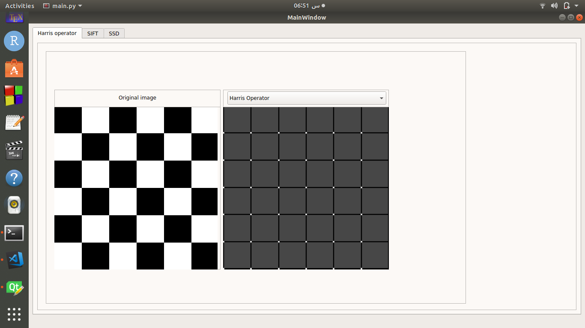
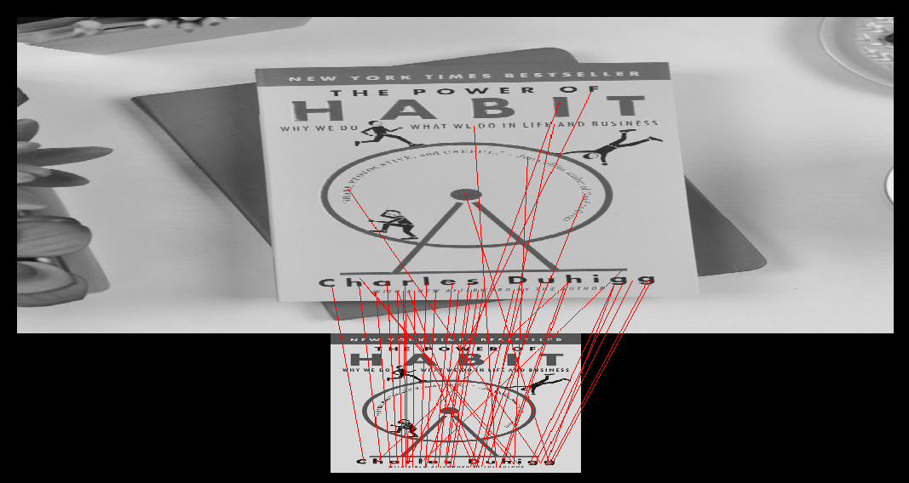
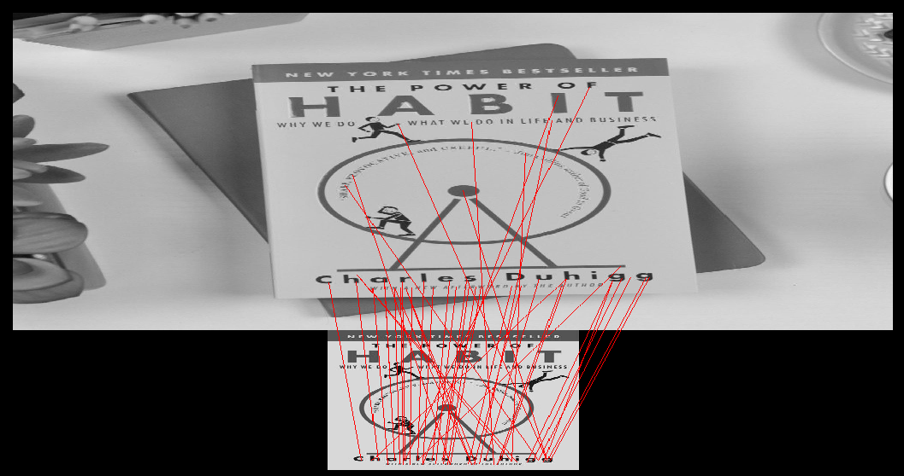

# Computer_vision_task_3

## Harris Feature Detection
### 1- Set the parameters
### 2- Read the Image
* Image is read using openCV in grayscale.

### 3- Calculate Image gradients
* Kernel operation using input operator of size 3*3
* Run the Sobel kernel for each pixel
* Eliminate the negative values: Multiply by -1

### 4- Use Gaussian blur

### 5- Calculate corner strength

### 6- Look for Corner strengths above the threshold

### 7- Perform Non-Maximum Suppression

## Input

## Ouptut

### Computation time for detecting these points:  
29.53090317 sec

# Features Matching
  - ## Using Sum of Squared Distances (SSD):
  After getting the features descriptors we match the descriptor of a feature from one image with all other features of another image by summing up the square of the difference between them and return the corresponding feature based on the minimum distance.

  #### Computation time for features matching using SSD:
   123.734375 sec

  

  - ## Using Normalized Cross Correlation (NCC):
  After matching the features descriptors using normalized cross correlation, the larger the value of correlation the more likely that the features points are similar.

  #### Computation time for features matching using NCC:
   928.65625 sec

  
